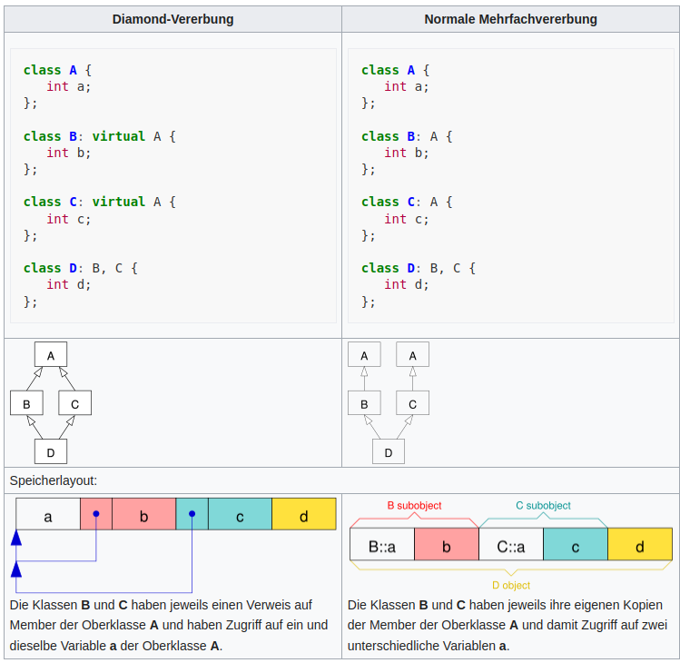

<[back](cpp03_01_inheritance.md) | [main](/) | [forward](cpp03_00_lerning.md)>

---

# Diamond Problem

In C++, multiple inheritance is allowed, which is not possible in other technologies like Java and C#.

With multiple inheritance, a problem arises when a class inherits from two classes that share the `same base class`. This leads to `multiple instances` and thus to `ambiguities`.

## Solution Approach
Use the `virtual` instantiation of base classes.

This creates only a `virtual base pointer`. These help in referring to the single instance of the virtual base class in the derived class hierarchy. Thus, at runtime, there is only a single instance of the virtual base class. Therefore, in the end, there is only one `physical instance` of the base class.

Example from [wikipedia](https://de.wikipedia.org/wiki/Diamond-Problem) (05.08.2024)

