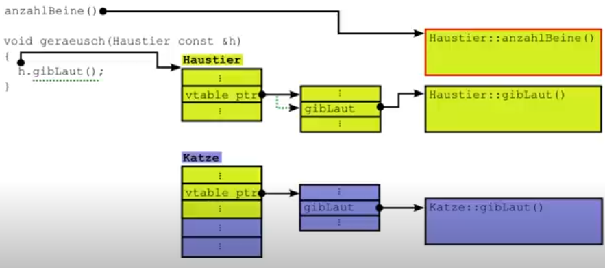
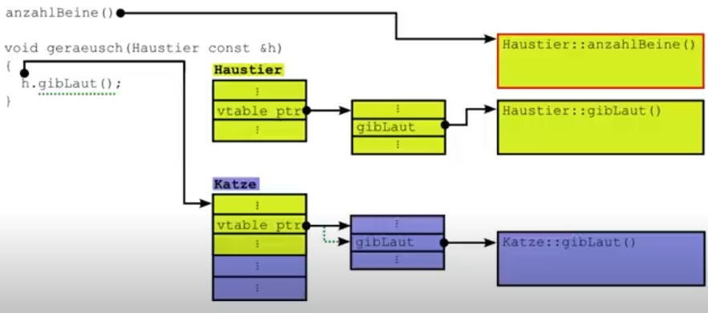

<[backward](cpp04_02_abstract_class.md) | [main](/) | [forward](cpp04_00_lerning.md) > 

---

# Virtual Table (vtable)

## Functionality
When a function is declared as `virtual`, the compiler creates a virtual table (vtable). This table contains pointers to the virtual functions of the class. `Each instance` (derived class) of the class contains `its own virtual table`.

In short, every class, whether derived or not, contains its respective function if it uses `virtual`. See the [comparative example](cpp04_01_sub-typing_polymorphism.md#example).

## Additional Example

```cpp
#include <iostream>
#include <string>

class Animal {
public:
    int numberOfLegs() { return 4; }
    virtual std::string makeSound() { return "Any sound, I don't know how I am?"; }
};

class Cat : public Animal {
public:
    int numberOfLegs() { return 3; }
    std::string makeSound() override { return "Meow"; }
};

int main() {
    Animal* animal = new Cat();
    std::cout << "Number of Legs: " << animal->numberOfLegs() << std::endl;  // Outputs 4
    std::cout << "Sound: " << animal->makeSound() << std::endl;  // Outputs "Meow"
    delete animal;
    return 0;
}
```

**Output example**
```shell
Number of Legs: 4
Sound: Meow
```

As seen here, even though `animal` is instantiated as a `Cat`, the pointer of type `Animal` returns the value of `Animal` for `numberOfLegs`. The `makeSound` function, however, correctly returns "Meow".

## Graphical Representation of the vtable




