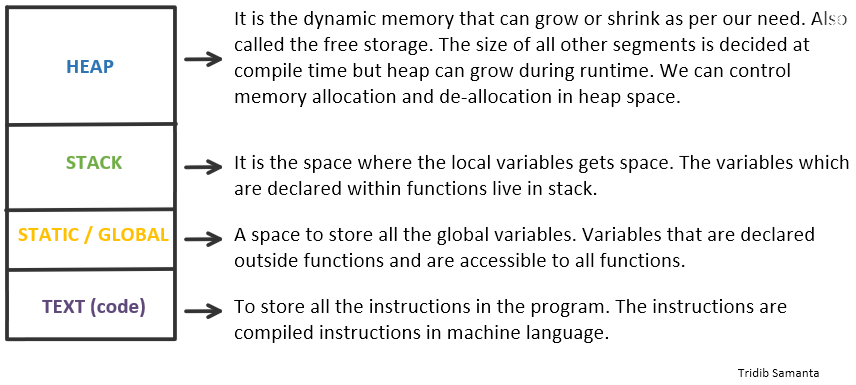

# Stack vs Heap Memory Allocation



## The Stack (static)
The is the temporary memory where variables are stored while a function is executing. When the function finishes, the memory is cleared automatically.

```cpp
int main()
{
  // All these variables get memory
  // allocated on stack
  int a;
  int b[10];
  int n = 20;
  int c[n];
  Cat Katze(); // Cat is symbolic for a Class
}
```

## The Heap (dynamic)
The Heap is memory that the programmer can use for the application in a more manual way. You have to allocate memory, use it, and then free it up afterwords all by hand.
```cpp


int main()
{
   // This memory for 10 integers
   // is allocated on heap.
   int *ptr  = new int[10];
   Animal* Katze=new Cat(); // Cat is symbolic for a Class
}
```

[Good Movie](https://www.youtube.com/watch?v=_8-ht2AKyH4)
